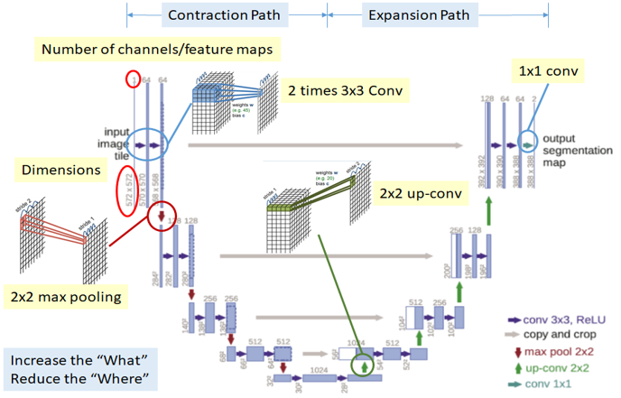
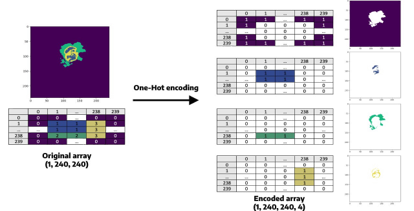
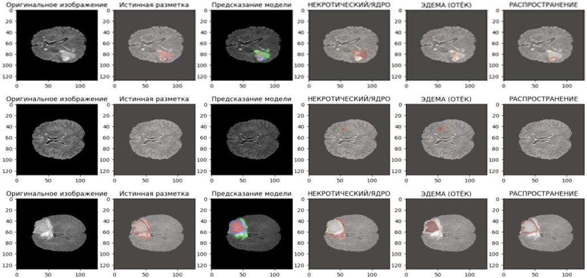
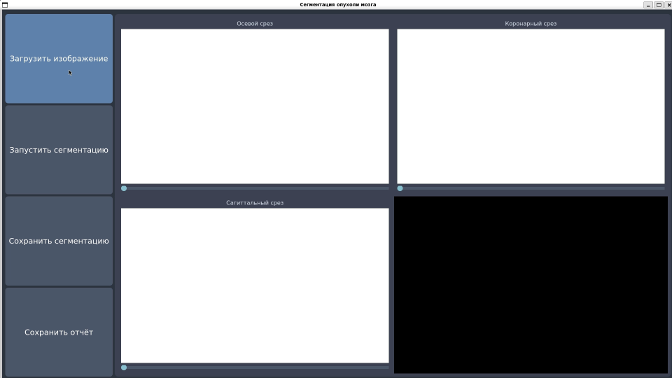

# 🧠 Brain Tumor Segmentation (Russian)

## 📘 Описание проекта

Проект посвящён разработке **алгоритма и программы для сегментации опухолей мозга** на МРТ-изображениях с использованием **глубоких нейронных сетей**.
Целью работы является **ускорение и повышение точности диагностики**, что критично для своевременного лечения пациентов.

Автоматизация процесса позволяет:

* снизить нагрузку на врачей-радиологов,
* минимизировать вероятность ошибок ручного анализа,
* обеспечить стабильное качество обработки снимков.

---

## 🧩 Используемые технологии

* **Язык программирования:** Python
* **Библиотеки:**

  * `TensorFlow`, `Keras` — построение и обучение нейросети
  * `scikit-learn` — обработка и анализ данных
  * `NumPy`, `Matplotlib` — визуализация и обработка изображений
  * `PyQt5` — разработка графического интерфейса пользователя

---

## 🧠 Архитектура модели

Для реализации задачи использовалась **архитектура U-Net**, специально разработанная для задач медицинской сегментации.
Модель состоит из **энкодера и декодера**, связанных пропусками (skip connections), что позволяет сохранять детали изображений при восстановлении.



---

## 🗂️ Датасеты

Для обучения и тестирования рассматривались четыре наиболее известных набора данных:

* BraTS
* ASNR
* TSIA
* FigShare

После сравнительного анализа был выбран **BraTS**, так как он содержит:

* размеченные опухоли разных типов,
* изображения в нескольких модальностях (T1, T2, FLAIR и др.),
* большое количество данных для обучения.


---

## ⚙️ Предобработка данных

1. Нормализация интенсивности пикселей
2. Изменение размера изображений
3. Аугментация (отражение, поворот, сдвиг)
4. Разделение выборки на обучающую, валидационную и тестовую части



---

## 📈 Обучение модели

Обучение проводилось на датасете BraTS.
В процессе наблюдалось **уменьшение ошибки и рост точности**, что свидетельствует о корректном обучении модели.


---

## 🧪 Результаты

Проверка модели проводилась на **отложенной выборке**.
Модель успешно выявила области опухолей на изображениях с высокой точностью.



---

## 💻 Интерфейс программы

Приложение имеет графический интерфейс, реализованный с помощью **PyQt5**.
Пользователь может:

* загрузить МРТ изображение,
* запустить процесс сегментации,
* получить визуализацию выделенной области опухоли.



---

## 🚀 Установка и запуск

### Требования:

* Python 3.9+

### Установка:

```bash
git clone https://github.com/username/brain-tumor-segmentation.git
cd brain-tumor-segmentation
pip install -r requirements.txt
```

### Запуск программы:

```bash
python final.py
```

---

## 📊 Примеры использования


---

## 📚 Заключение

В результате проделанной работы:

* разработан алгоритм и программа для сегментации опухолей мозга на МРТ изображениях,
* проведён анализ существующих подходов,
* реализована нейросетевая архитектура на основе U-Net,
* создан удобный пользовательский интерфейс.

Проект может быть использован в **диагностических системах** и в **исследовательских целях**.

---

## 👤 Автор

**Андрей Болгов**
