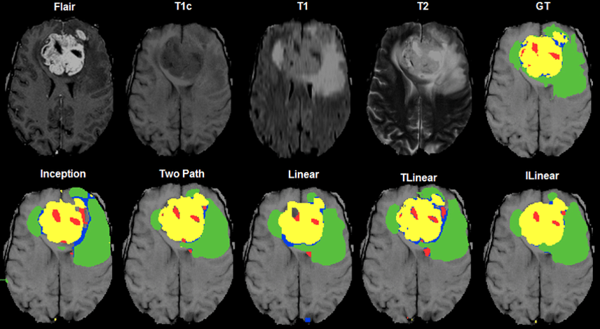
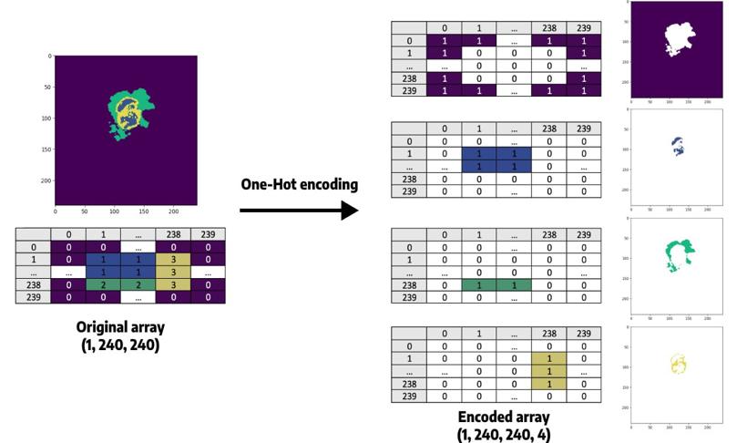
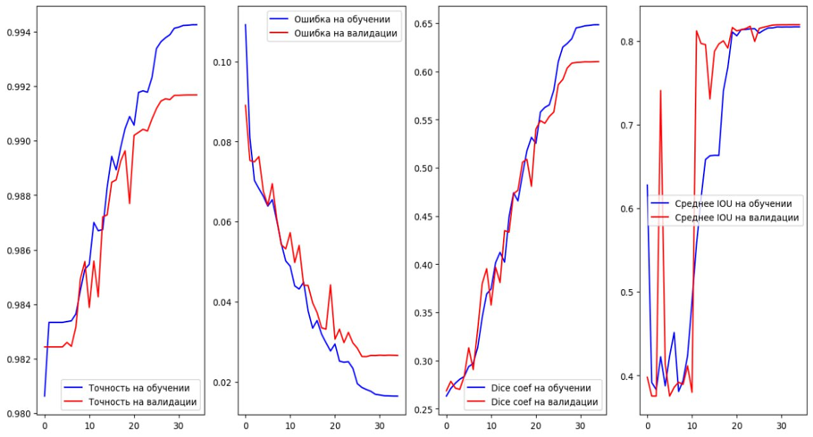
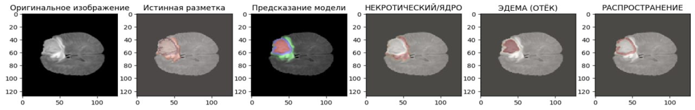
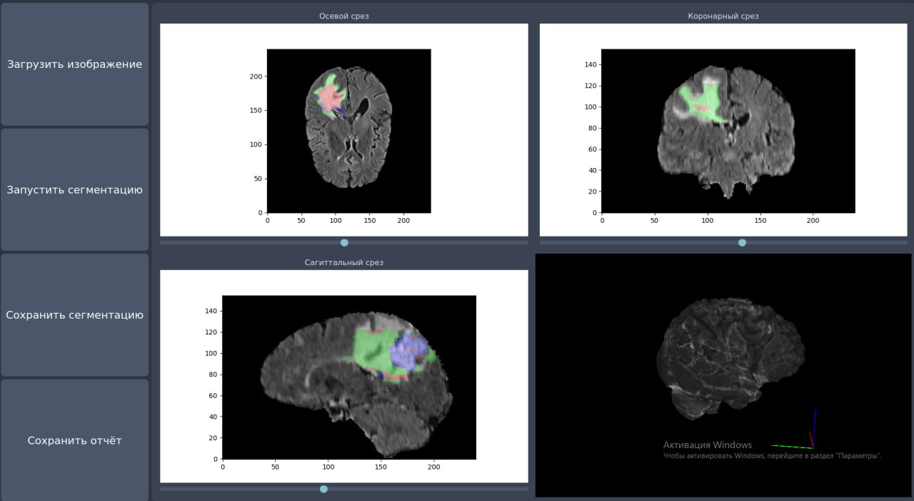

# 🧠 Brain Tumor Segmentation

## 📘 Project Overview

This project is dedicated to the **development of an algorithm and software for brain tumor segmentation** from MRI images using **deep learning** methods.
The goal is to **improve the speed and accuracy of diagnosis**, which is critical for timely medical treatment.

Automation allows to:

* reduce the workload on radiologists,
* minimize the risk of human errors,
* ensure consistent image analysis quality.

---

## 🧩 Technologies Used

* **Programming language:** Python
* **Libraries and frameworks:**

  * `TensorFlow`, `Keras` — building and training the neural network
  * `scikit-learn` — data preprocessing and evaluation
  * `NumPy`, `Matplotlib` — data manipulation and visualization
  * `PyQt5` — GUI development

---

## 🧠 Model Architecture

The model is based on the **U-Net** architecture, designed specifically for biomedical image segmentation.
U-Net consists of an **encoder-decoder** structure with **skip connections**, which help preserve fine details during upsampling.


---

## 🗂️ Dataset

Four popular public datasets were analyzed:

* BraTS
* ASNR
* TSIA
* FigShare

After comparison, **BraTS** was selected because it includes:

* well-annotated tumor masks,
* multiple MRI modalities (T1, T2, FLAIR, etc.),
* a large number of labeled samples for training.



---

## ⚙️ Data Preprocessing

1. Intensity normalization
2. Image resizing
3. Data augmentation (flipping, rotation, shifting)
4. Splitting into training, validation, and test sets



---

## 📈 Model Training

The model was trained using the BraTS dataset.
During training, **loss decreased and accuracy improved**, indicating proper learning behavior.



---

## 🧪 Results

The model was evaluated on a **held-out test set** that was not used during training.
The trained model successfully detected tumor regions with high accuracy.



---

## 💻 Graphical Interface

The desktop application was implemented using **PyQt5**.
The user interface allows:

* uploading MRI images,
* running segmentation,
* visualizing detected tumor regions.


---

## 🚀 Installation and Run

### Installation

```bash
git clone https://github.com/username/brain-tumor-segmentation.git
cd brain-tumor-segmentation
pip install -r requirements.txt
```

### Running the Application

```bash
python final.py
```

---

## 📊 Usage Example



---

## 📚 Conclusion

As a result of this work:

* an algorithm and software for brain tumor segmentation from MRI images were developed,
* a comparative analysis of modern approaches was conducted,
* a U-Net–based neural architecture was implemented,
* a user-friendly interface was created for medical image analysis.

This project can be used in **diagnostic systems** and **research applications** for medical imaging.

